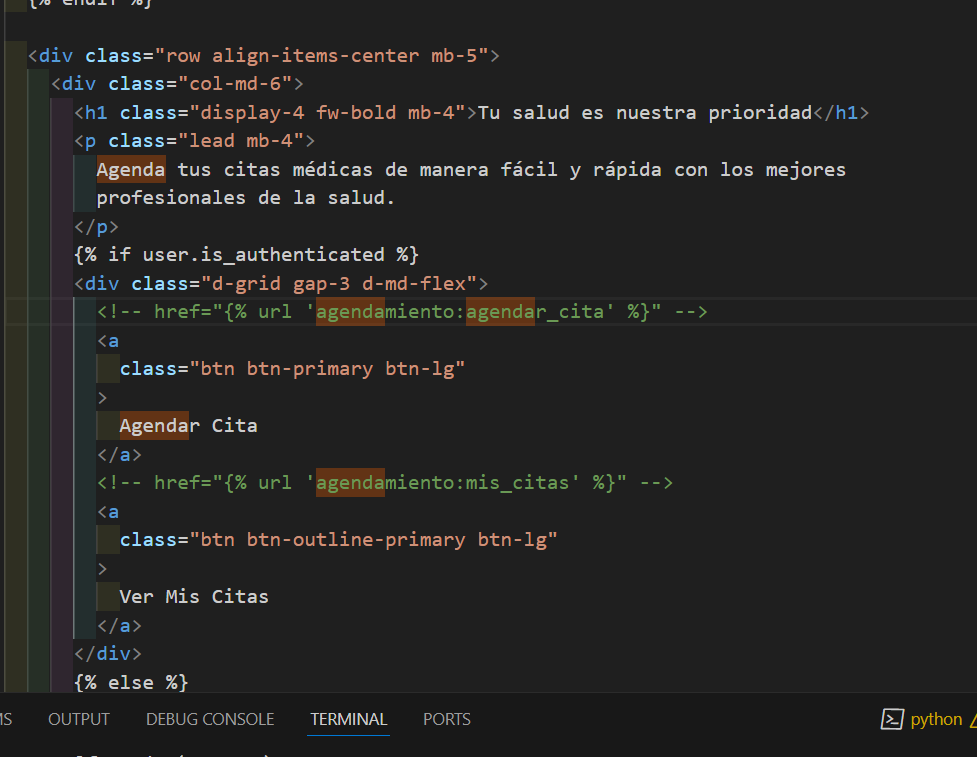

# VetCareProject

Proyecto de agenda de citas para veterinaria usando Django.

## Estructura actual

- Proyecto principal: `vetcareProject`
- Aplicación principal: `vetApp`
- Plantillas en: `vetApp/templates/`
- Dependencias listadas en: `requirements.txt`
- Variables de entorno ignoradas en: `.gitignore`

---

## Configuración inicial

### 1. Clona el repositorio

```bash
git clone <URL_DEL_REPOSITORIO>
cd VetCare-Project
```

### 2. Crea y activa un entorno virtual

**Windows:**

```bash
python -m venv env
env\Scripts\activate
```

**Linux/Mac:**

```bash
python3 -m venv env
source env/bin/activate
```

### 3. Instala las dependencias

```bash
pip install -r requirements.txt
```

---

## Comandos básicos para iniciar el proyecto

### 1. Aplica migraciones

```bash
python manage.py migrate
```

### 2. Crea un superusuario (opcional, para acceder al admin)

```bash
python manage.py createsuperuser
```

### 3. Corre el servidor de desarrollo

```bash
python manage.py runserver
```

Accede a la app en [http://localhost:8000/](http://localhost:8000/)

---

## Estructura de carpetas relevante

```
vetcareProject/
│
├── vetcareProject/      # Configuración principal del proyecto
├── vetApp/              # Aplicación principal
│   └── templates/
│       └── Home/
│           └── home.html
├── manage.py
├── requirements.txt
└── .gitignore
```

---

## Notas

- Las variables de entorno deben ir en un archivo `.env` (no incluido en el repositorio).
- Para agregar nuevas dependencias, instálalas con `pip install <paquete>` y luego ejecuta `pip freeze > requirements.txt`.
- Para agregar nuevas apps, usa:
  ```bash
  python manage.py startapp
  ```
    <!-- href="" -->
  
